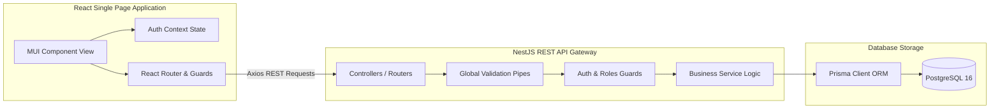
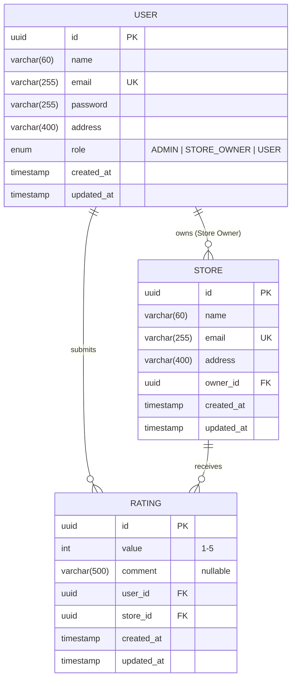

# 🏪 Store Rating Platform — Recruiter Showcase & Documentation

An enterprise-grade, full-stack **Store Rating Platform** designed for business listings and customer satisfaction metrics. The system is built with a role-restricted architecture separating administrative, commercial (owner), and consumer operations.

---

# 📑 Table of Contents

* [Live Application](#-live-application)
* [System Architecture](#️-system-architecture)
* [Technology Stack & Design Rationale](#️-technology-stack--design-rationale)
* [Roles & Capabilities Matrix](#-roles--capabilities-matrix)
* [Design Decisions & How We Did It](#️-design-decisions--how-we-did-it)
* [Comprehensive API Endpoint Documentation](#-comprehensive-api-endpoint-documentation)
* [Step-by-Step Installation & Running Guide](#️-step-by-step-installation--running-guide)
* [Seeding & Test Credentials](#-seeding--test-credentials)
* [API Integration Testing](#-api-integration-testing)
* [Code Audit & Quality Documentation](#-code-audit--quality-documentation)
* [Database Schema (ERD)](#️-database-schema-erd)
* [Production Deployment](#️-production-deployment)
* [Repository Structure](#-repository-structure)
* [License](#-license)
---

## 🚀 Live Application

### Frontend (Vercel)

https://store-rating-platform-drab.vercel.app

### Backend API (Render)

https://store-rating-api-cq0y.onrender.com/api

### Health Check

https://store-rating-api-cq0y.onrender.com/api/health

---
## 📸 Application Screenshots

### 🔐 Authentication

#### Login Page

#### Signup Page


---

### 👨‍💼 Administrator Module

#### Admin Dashboard


#### User Management


---

### 👤 User Module

#### Submit Rating


#### Customer Reviews


---

### 🏪 Store Owner Module

#### Store Owner Dashboard


---


## 🏛️ System Architecture

The platform separates frontend user experience, backend logic, and database state into three decoupled layers:



---

## 🛠️ Technology Stack & Design Rationale

### 1. Backend: NestJS & TypeScript
* **Why NestJS?** NestJS provides an out-of-the-box modular architecture (`Module`, `Controller`, `Service`) that enforces solid design patterns (Dependency Injection, Single Responsibility). It ensures clean separation of concerns and high testability.
* **Why TypeScript?** Static typing catches database model discrepancies and request payload schema errors at compile time, eliminating runtime type errors.

### 2. Database & ORM: PostgreSQL & Prisma
* **Why PostgreSQL?** A robust, ACID-compliant relational database. It ensures data consistency and integrity for user accounts, store registries, and unique user-store reviews.
* **Why Prisma?** Prisma provides type-safe query building and automatic migration generation based on a single source of truth (`schema.prisma`). It completely prevents database drift.

### 3. Authentication: JWT (JSON Web Tokens) & Bcrypt
* **Why JWT?** Enables stateless, secure authentication. The API server signs tokens with a secure key, and the client stores it in local storage to authenticate requests via HTTP `Authorization: Bearer <token>` headers.
* **Why Bcrypt?** Standard password hashing with automated salting rounds prevents credential leaks even in the event of database exposure.

### 4. Frontend: React 18, Vite & Material UI (MUI)
* **Why Vite?** Provides a near-instant developer feedback loop (Hot Module Replacement) and optimized production bundles.
* **Why Material UI?** Offers premium, accessible, and responsive components. Configured with a modern dark theme, smooth glassmorphism layers, and subtle CSS micro-animations.
* **Why React Context API?** Used for global state management (retaining user login sessions, token storage, and live profile updates).

---

## 👥 Roles & Capabilities Matrix

The platform implements role-based access control (RBAC) at both the backend service layers (via guards) and the frontend routing levels (via private route wrapper components):

| Capability | Admin | Store Owner | Normal User (Customer) |
| :--- | :---: | :---: | :---: |
| **User Management** (Create, list, edit, delete users) | **Full CRUD** | **None** | **None** |
| **Store Registry** (Add, edit store parameters) | **Full CRUD** | **Manage Own Only** | **None** |
| **Rating & Reviews** (Submit/modify reviews) | **Delete Only** (Moderation) | **None** | **Write / Edit Own Only** |
| **Profile Management** (Change personal info) | **Self + All** | **Self Only** | **Self Only** |
| **Dashboards** | **Global Metrics** | **Store Metrics** | **Browse Directory** |

---

## ⚙️ Design Decisions & How We Did It

### 1. Ensuring Single Reviews (Upsert Pattern)
* **Requirement**: "A user can rate a store only once. Subsequent ratings must update the existing one."
* **Solution**: In `schema.prisma`, we established a compound unique constraint:
  ```prisma
  @@unique([userId, storeId])
  ```
  In `ratings.service.ts`, we utilized Prisma's `upsert` mechanism. If a matching `userId_storeId` key is found, Prisma performs an update; otherwise, it creates a new record. This guarantees database-level integrity and prevents duplicate reviews.

### 2. Guarding Against Role Escalation
* **Risk**: Public registration endpoints are vulnerable to attackers requesting the `ADMIN` role.
* **Solution**: In `AuthService.register`, we implemented a check:
  ```typescript
  if (dto.role === Role.ADMIN) {
    throw new ForbiddenException('Registration as Admin is not permitted');
  }
  ```
  Administrative accounts can only be provisioned by existing Admins via the restricted `/api/users` endpoint.

### 3. Dynamic Profile Synchronization
* **Requirement**: "Allow users to modify profile details."
* **Solution**:
  1. We added the `PUT /api/auth/profile` endpoint to let logged-in users update their name, email, and address.
  2. We extended the frontend `AuthContext` to expose an `updateUser(user)` handler. When profile updates succeed, the React global state is immediately synced, updating sidebar displays and profile inputs without requiring a full page refresh.

---

## 📋 Comprehensive API Endpoint Documentation

All requests (except registration and login) must include `Authorization: Bearer <token>` in the headers.

### 1. Authentication & Profile
* **`POST /api/auth/register`** (Public)
  * Payload: `RegisterDto` (name, email, password, address, role)
  * Returns: `{ accessToken: string, user: SafeUser }`
* **`POST /api/auth/login`** (Public)
  * Payload: `LoginDto` (email, password)
  * Returns: `{ accessToken: string, user: SafeUser }`
* **`GET /api/auth/me`** (Protected - All Roles)
  * Returns: The logged-in user profile, including role and physical address.
* **`PUT /api/auth/profile`** (Protected - All Roles)
  * Payload: `UpdateProfileDto` (name, email, address)
  * Returns: The updated profile object.
* **`PUT /api/auth/change-password`** (Protected - All Roles)
  * Payload: `ChangePasswordDto` (oldPassword, newPassword)
  * Returns: `{ message: "Password changed successfully" }`

### 2. User Management (Admin Only)
* **`GET /api/users`** - Paginated search and filtering of all users.
* **`GET /api/users/:id`** - Retrieve specific user profile and count of stores/ratings.
* **`POST /api/users`** - Directly create a user with hashed password.
* **`PUT /api/users/:id`** - Modify user details or administrative role.
* **`DELETE /api/users/:id`** - Delete user account (automatically cascades to reviews).

### 3. Store Registry
* **`GET /api/stores`** (Protected - All Roles)
  * Query parameters: `page`, `limit`, `search`, `name`, `address`, `sortBy`, `sortOrder`
  * Returns: A list of stores. For the requester, it embeds their own specific rating to let frontend components render rating options immediately.
* **`GET /api/stores/:id`** (Protected - All Roles)
  * Returns: Full details of the store, including overall average score, total review count, and a list of all user comments.
* **`POST /api/stores`** (Protected - Admin & Owner)
  * Payload: `CreateStoreDto` (name, email, address)
  * Registers a store under the current user's ID.
* **`PUT /api/stores/:id`** (Protected - Admin & Owner)
  * Modifies store parameters. Owners can only edit their own stores.
* **`DELETE /api/stores/:id`** (Protected - Admin Only)
  * Deletes a store from the platform.

### 4. Ratings & Reviews
* **`POST /api/ratings`** (Protected - User Only)
  * Payload: `{ storeId, value, comment }`
  * Upserts a rating between 1 and 5.
* **`PUT /api/ratings/:id`** (Protected - User Only)
  * Payload: `{ value, comment }`
  * Modifies an existing rating. Restricted to the author.
* **`DELETE /api/ratings/:id`** (Protected - Admin Only)
  * Moderation tool to delete inappropriate customer reviews.

### 5. Dashboards
* **`GET /api/admin/dashboard`** (Protected - Admin Only)
  * Returns: `{ totalUsers, totalStores, totalRatings }`
* **`GET /api/owner/dashboard/stats`** (Protected - Store Owner Only)
  * Returns: `{ totalStores, totalRatings, averageRating }` (for stores owned by the user).
* **`GET /api/owner/dashboard/ratings`** (Protected - Store Owner Only)
  * Returns: Paginated, sortable reviews left on all stores belonging to the owner.

---

## 🛠️ Step-by-Step Installation & Running Guide

### 1. Configure PostgreSQL Database

Install PostgreSQL locally and create a database named:

store_rating_db

Update the backend .env file with your PostgreSQL connection string.


### 2. Configure & Start the Backend API
Navigate to the backend, set environment variables, run migrations, and run seed data:
```bash
cd backend
npm install
cp .env.example .env

# Generate Prisma database client
npx prisma generate

# Run database migrations to construct the tables
npx prisma migrate dev --name init

# Populate database with mock developers, store owners, stores, and ratings
npx prisma db seed

# Run server in development watch mode
npm run start:dev
```
* Backend starts at `http://localhost:3000/api`

### 3. Configure & Start the Frontend SPA
Navigate to the frontend directory, install packages, and boot Vite:
```bash
cd ../frontend
npm install
cp .env.example .env

# Boot the Vite client
npm run dev
```
* Web app opens at `http://localhost:5173`

---

## 🧪 Seeding & Test Credentials

The database seed creates a robust and realistic development environment:
* **System Admin**:
  * Email: `admin@storerating.com`
  * Password: `Admin@1234`
* **Store Owners** (4 accounts):
  * Email: `owner@storerating.com` (also `owner2@storerating.com`, `owner3@storerating.com`, `owner4@storerating.com`)
  * Password: `Owner@1234`
* **Regular Customers** (10 accounts):
  * Email: `user@storerating.com` (also `user2@storerating.com` to `user10@storerating.com`)
  * Password: `User@12345`

---

## 📋 API Integration Testing

We have built a comprehensive Postman Collection located at [postman_collection.json](file:///c:/Users/Admin/OneDrive/Desktop/Roxiler_Coding_Challenge/postman_collection.json).

### Running postman tests:
1. Import [postman_collection.json](file:///c:/Users/Admin/OneDrive/Desktop/Roxiler_Coding_Challenge/postman_collection.json) into Postman.
2. Select an environment and ensure `baseUrl` is set to `http://localhost:3000/api`.
3. Log in using any of the authentication requests. The collection features test scripts that dynamically parse the JSON response, extract the `accessToken` token, and save it as a global `token` variable, authorizing all subsequent requests automatically.

---

## 🔍 Code Audit & Quality Documentation

To verify enterprise compliance, we performed a full security, functionality, and performance audit. Detailed reports are available under the `/audit` folder:

1. **Functional Gaps & Audit Report** (`audit/missing_features.md`): Details the requirements checked, functional bugs fixed (e.g. name length validation limits), and the user profile update integration.
2. **Security Hardenings & Audit Report** (`audit/security_improvements.md`): Documents role-escalation preventions, rate limiting, and HTTP security headers (Helmet).
3. **Performance & Aggregations Report** (`audit/performance_improvements.md`): Evaluates query execution paths, database indexing suggestions, and frontend bundle sizes.
4. **Deployment Operations Report** (`audit/deployment_instructions.md`): Production release guidelines utilizing Docker containers and multi-AZ cloud infrastructures (AWS ECS Fargate + AWS RDS PostgreSQL).
5. **DevOps & Full Stack Audit** (`audit/devops_fullstack_audit.md`): Senior-level audit covering requirement coverage, JWT/CORS/Prisma production verification, and troubleshooting guide.

---

## 🗄️ Database Schema (ERD)



> **Constraint**: `RATING` has a compound unique index on `(user_id, store_id)`, enforcing that each user can rate a store only once.

---

## ☁️ Production Deployment 

### Deploy Backend on Render

1. **Push code to GitHub** and connect the repository to [Render](https://render.com).
2. **Create a PostgreSQL database** on Render (Free tier available).
3. **Create a Web Service** with the following settings:

| Setting | Value |
| :--- | :--- |
| **Root Directory** | `backend` |
| **Build Command** | `npm install && npm run build` |
| **Start Command** | `npx prisma migrate deploy && npm run start:prod` |
| **Environment** | Node |

4. **Add Environment Variables** in the Render dashboard:

| Variable | Value |
| :--- | :--- |
| `DATABASE_URL` | *(Copy the Internal Database URL from your Render PostgreSQL dashboard)* |
| `JWT_SECRET` | *(Generate: `node -e "console.log(require('crypto').randomBytes(64).toString('hex'))"`)* |
| `JWT_EXPIRATION` | `24h` |
| `NODE_ENV` | `production` |
| `CORS_ORIGIN` | *(Your Vercel frontend URL, e.g. `https://your-app.vercel.app`)* |

> **Note**: Render automatically sets the `PORT` variable. The `postinstall` script in `package.json` runs `npx prisma generate` automatically during `npm install`.

### Deploy Frontend on Vercel

1. **Import the repository** on [Vercel](https://vercel.com).
2. **Set the Root Directory** to `frontend`.
3. **Framework Preset**: Vite.
4. **Add Environment Variable**:

| Variable | Value |
| :--- | :--- |
| `VITE_API_BASE_URL` | *(Your Render backend URL, e.g. `https://store-rating-backend.onrender.com/api`)* |

5. **Deploy**. The `vercel.json` file in the frontend directory automatically configures SPA routing (all paths → `index.html`).

### After Both Are Deployed

1. Copy your Vercel frontend URL (e.g. `https://your-app.vercel.app`).
2. Go to Render → Backend Web Service → Environment → Set `CORS_ORIGIN` to the Vercel URL.
3. Restart the Render service.
4. **Seed the production database** (optional): Use Render's Shell tab to run:
   ```bash
   cd backend && npx prisma db seed
   ```

---

## 📁 Repository Structure

```text
Roxiler_Coding_Challenge/
├── backend/                      # NestJS REST API
│   ├── prisma/
│   │   ├── schema.prisma         # Database schema (models, relations, constraints)
│   │   ├── migrations/           # Auto-generated SQL migration files
│   │   └── seed.ts               # Database seed script (15 users, 8 stores, 30 ratings)
│   ├── src/
│   │   ├── common/               # Shared guards, decorators, filters, interceptors
│   │   ├── config/               # Environment config service
│   │   ├── health/               # Health check module (/api/health)
│   │   ├── modules/
│   │   │   ├── auth/             # Registration, login, JWT, profile management
│   │   │   ├── users/            # Admin user CRUD
│   │   │   ├── stores/           # Store registry CRUD
│   │   │   ├── ratings/          # Rating upsert and moderation
│   │   │   ├── admin/            # Admin dashboard stats
│   │   │   └── owner/            # Owner dashboard stats & ratings feed
│   │   ├── prisma/               # Prisma service module
│   │   ├── app.module.ts         # Root module
│   │   └── main.ts               # Application bootstrap & CORS config
│   ├── .env.example              # Backend environment template
│   └── package.json              # Dependencies & scripts (includes postinstall for Prisma)
├── frontend/                     # React SPA (Vite + MUI)
│   ├── src/
│   │   ├── components/           # Layout (Header, Sidebar), Guards, Common (StarRating)
│   │   ├── contexts/             # AuthContext (global user state & token)
│   │   ├── hooks/                # useAuth hook
│   │   ├── pages/                # Auth, Dashboard, Stores, Users, Profile views
│   │   ├── routes/               # React Router config with role-based guards
│   │   ├── services/             # Axios API clients (auth, store, rating, user, admin, owner)
│   │   ├── theme/                # MUI dark theme configuration
│   │   └── types/                # TypeScript interfaces & enums
│   ├── vercel.json               # Vercel SPA rewrite rules
│   ├── .env.example              # Frontend environment template
│   └── package.json              # Dependencies & scripts
├── audit/                        # Code quality & DevOps audit reports
│   ├── missing_features.md       # Requirement coverage & bug fixes
│   ├── security_improvements.md  # Security hardening recommendations
│   ├── performance_improvements.md # Database indexing & query optimizations
│   ├── deployment_instructions.md  # Render & Vercel deployment guide
│   └── devops_fullstack_audit.md   # Senior DevOps audit & troubleshooting
├── render.yaml                   # Render Infrastructure-as-Code blueprint
├── postman_collection.json       # Postman API testing collection
└── README.md                     # This file
```


## 📄 License

MIT

