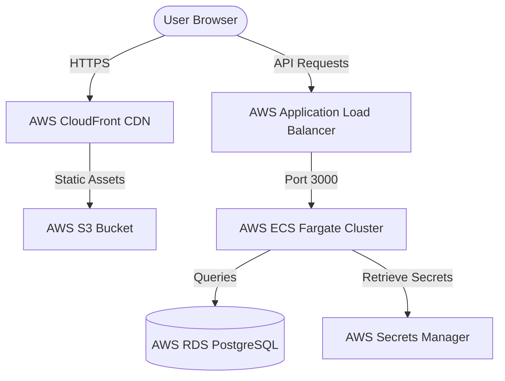

# Audit Report: Deployment & Production Operations Guide

This guide details the steps and strategies for deploying the **Store Rating Platform** to local, staging, and cloud production environments.

---

## 🛠️ Local Development & Quickstart

To run the application locally in development mode:

### 1. Database Infrastructure
Launch PostgreSQL using the pre-configured `docker-compose.yml`:
```bash
docker-compose up -d
```

### 2. Backend API Setup
Configure and start the NestJS server:
```bash
cd backend
npm install
cp .env.example .env
# Edit .env with your local credentials if needed
npx prisma generate
npx prisma migrate dev --name init
npm run start:dev
```
* API runs at: `http://localhost:3000/api`

### 3. Frontend SPA Setup
Install dependencies and run the Vite dev server:
```bash
cd frontend
npm install
cp .env.example .env
# Verify VITE_API_URL is pointing to http://localhost:3000/api
npm run dev
```
* App runs at: `http://localhost:5173`

---

## 🐳 Production Containerized Deployment (Docker Compose)

For deploying the platform to a single Virtual Private Server (VPS) like DigitalOcean, Linode, or AWS EC2:

### 1. Configure Production Environment Variables
Create a production `.env` file on the host server:
```env
# Database configuration
POSTGRES_DB=store_rating_db
POSTGRES_USER=db_user
POSTGRES_PASSWORD=your_strong_db_password

# Backend environment
PORT=3000
NODE_ENV=production
DATABASE_URL="postgresql://db_user:your_strong_db_password@db:5432/store_rating_db?schema=public"
JWT_SECRET="generate-a-cryptographically-secure-key-here"
JWT_EXPIRATION="24h"
CORS_ORIGIN="https://yourdomain.com"
```

### 2. Launch Stack in Detached Mode
Write a production-ready `docker-compose.prod.yml` or run:
```bash
docker-compose -f docker-compose.yml up -d --build
```
Ensure that migrations are executed during deployment by wrapping the NestJS entry point in a start script:
```bash
# In the backend container entrypoint
npx prisma migrate deploy
npm run start:prod
```
> [!IMPORTANT]
> Always use `npx prisma migrate deploy` in production pipelines. Never use `migrate dev` as it is designed for interactive environments and may attempt to recreate or reset the database.

---

## ☁️ Cloud Native Architecture (AWS)

For highly available, scalable enterprise deployments, we recommend a cloud-native architecture on AWS:



### 1. Frontend Hosting (S3 + CloudFront)
1. Build static React assets: `cd frontend && npm run build` (outputs to the `dist` directory).
2. Upload the `dist/` contents to an **AWS S3 Bucket** configured for static web hosting.
3. Front the S3 bucket with **AWS CloudFront** (CDN) to enable globally distributed content caching and HTTPS. Attach an SSL Certificate from AWS Certificate Manager (ACM).

### 2. Backend Hosting (ECS Fargate)
1. Package the NestJS application into a Docker container.
2. Deploy the container to **AWS ECS (Elastic Container Service) with AWS Fargate** for serverless container execution.
3. Configure an **Application Load Balancer (ALB)** in front of the ECS tasks to handle incoming SSL connections (port 443) and route traffic to the backend containers (port 3000).

### 3. Managed Database (AWS RDS)
1. Provision a multi-AZ **AWS RDS PostgreSQL** instance.
2. Place RDS within private subnets and restrict access via AWS Security Groups so only backend ECS tasks can establish database connections.

### 4. Secret & Configuration Management
* Store sensitive keys (`DATABASE_URL`, `JWT_SECRET`) securely in **AWS Secrets Manager** or **Systems Manager Parameter Store**. 
* Inject them directly into ECS tasks as environment variables at runtime, preventing plain-text secrets from leaking into container images or repository commits.
